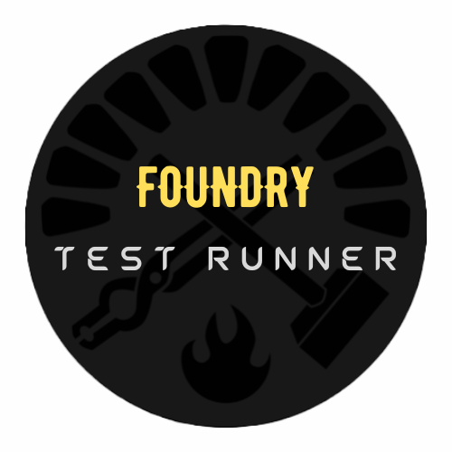
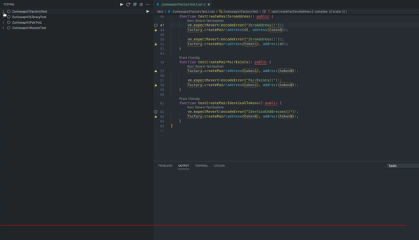
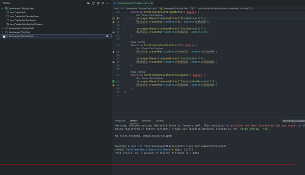

# VSCode Foundry Test Runner • 

An extension for VSCode editor to easily explore and run tests using the [foundry framework](https://github.com/gakonst/foundry). This is an adapter that is intended to work with the [Test Explorer UI](https://marketplace.visualstudio.com/items?itemName=hbenl.vscode-test-explorer) extension.

> Note: This adapter is in a very early stage. Beta testers are welcome!

---

### Features at a glance:

- Displays a Test Explorer in the Test view of VS Code's sidebar with all detected tests and suites along with their state.
- Adds CodeLenses to your test files for running specific tests.
- Display test logs in the Output panel.
- Allows for verbosity configuration.
- Exclude test files and test functions.
- More to come....

---

## Requirements

The following will need to be installed in order to use this template. Please follow the links and instructions.

- [Foundry / Foundryup](https://github.com/gakonst/foundry)
  - This will install `forge`, `cast`, `chisel` and `anvil`
  - You can test you've installed them right by running `forge --version` and get an output like: `forge 0.2.0 (f016135 2022-07-04T00:15:02.930499Z)`
  - To get the latest of each, just run `foundryup`

## Usage

The usage of this extension is straightforward. 
- Install this adapter extension.
- Install the [Test Explorer UI](https://marketplace.visualstudio.com/items?itemName=hbenl.vscode-test-explorer) extension.
- Click on the Test Icon displayed on the Activity bar.
- Run your tests using the Run icon in the Test Explorer or the CodeLenses in your test file

### 1.) Run a single test from the explorer

---

### 2.) Run a test suite (all the tests in a contract) from the explorer

---

### 3.) Run a test using the Codelens (inline option in the editor)

---

<!-- CONTRIBUTING -->

## Contributing

Contributions are welcomed. Any contributions you make are **greatly appreciated**.

1. Fork the Project
2. Create your Feature Branch (`git checkout -b feature/AmazingFeature`)
3. Commit your Changes (`git commit -m 'Add some AmazingFeature'`)
4. Push to the Branch (`git push origin feature/AmazingFeature`)
5. Open a Pull Request

<!-- TODO -->

## TODO

- [x] Contract-level codelens to run test suites from the editor
- [x] Flexibility to set the verbosity level
- [x] Add options to exclude tests and test files
- [ ] Add option to debug the tests

## Acknowledgement

- [Mocha Test Adapter](https://github.com/hbenl/vscode-mocha-test-adapter)